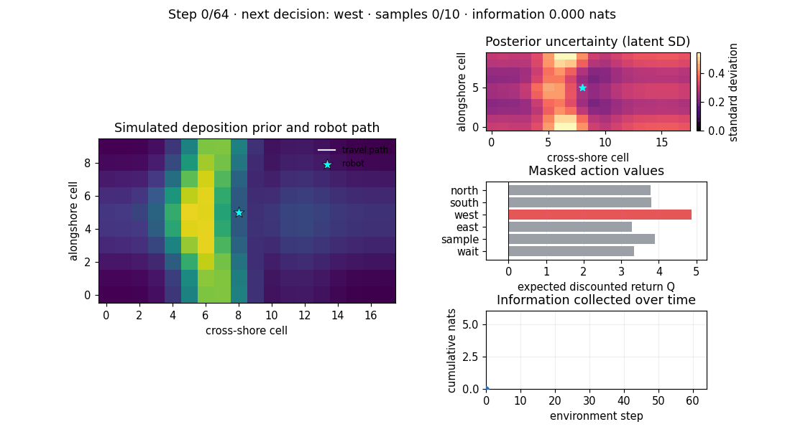
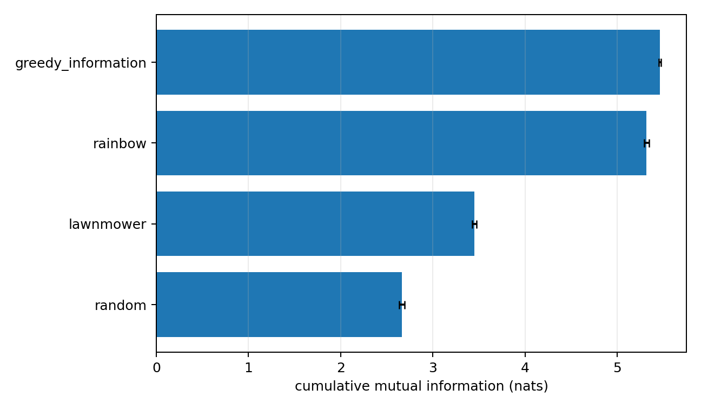
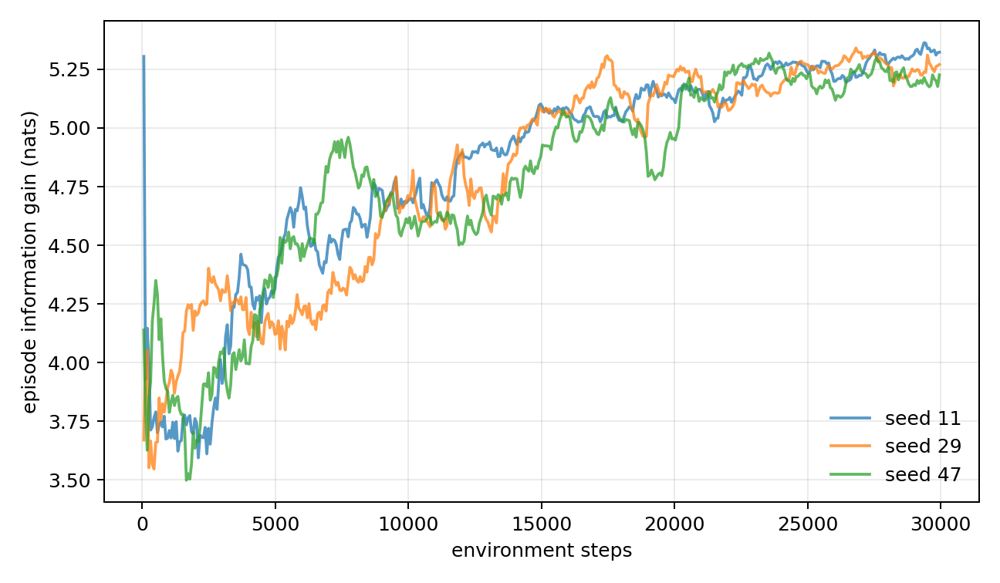
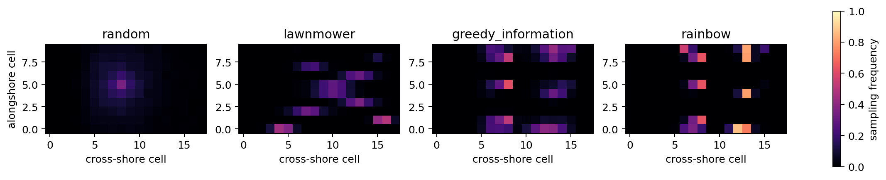
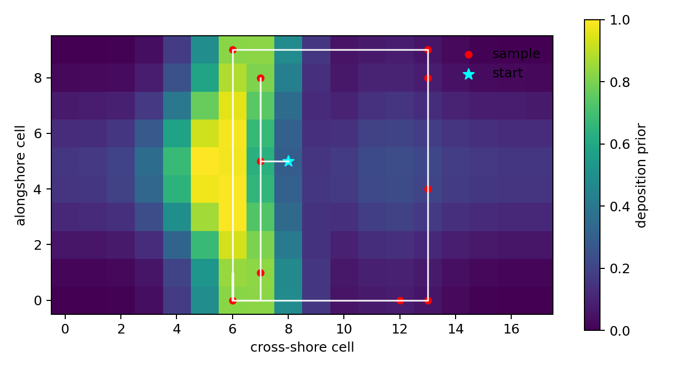
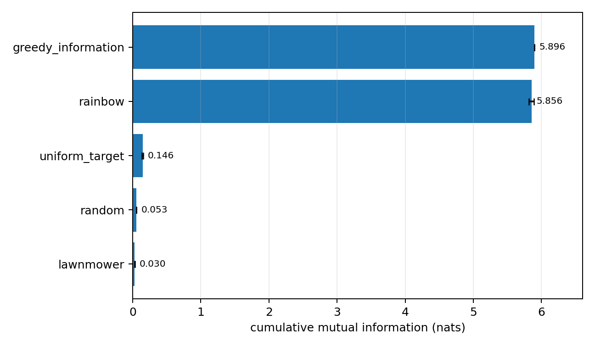
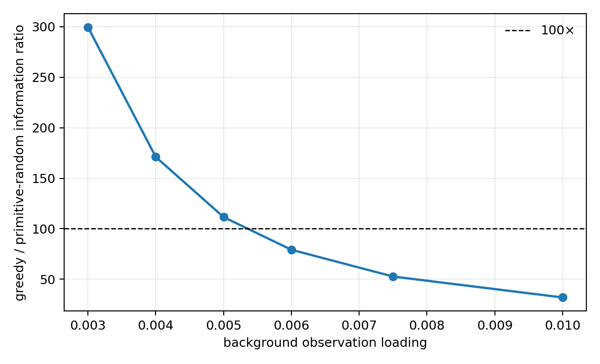

# Autonomous beach microplastic sampling with Bayesian Rainbow-DQfD

I developed this research project to study how an autonomous mobile robot can choose
where to travel and sample when its time and sampling budget are limited. Beach
microplastic surveys are spatial decision problems: measurements are costly, nearby
locations can be redundant, and the most informative cells may require substantial
travel. My goal was therefore not simply to visit many cells, but to learn a route
that reduces uncertainty about an unobserved spatial field as efficiently as possible.

My primary result is deliberately modest and evidence-based. On 1,024 held-out
procedural beach profiles, my Rainbow-DQfD policy collected **5.315 nats** of mutual
information compared with **2.661 nats** for uniformly random valid actions. This is
a **1.997× improvement** (95% hierarchical-bootstrap interval **[1.974×, 2.022×]**).
The learned policy achieved 97.3% of the information collected by a strong
model-based greedy planner; it did not outperform that planner.

## The algorithm in action



This animation follows one trained agent on held-out profile 50,000. The left panel
shows the simulated deposition-risk prior, the robot, its path, and sampled cells.
The upper-right panel shows the Bayesian posterior standard deviation. The middle
panel exposes the network's masked action values and highlights the action selected
at each step. The lower panel accumulates the exact information obtained from
samples. The initial state has no measurements and broad uncertainty; after ten
samples, uncertainty has contracted around informative basis regions and the agent
has collected 5.615 nats on this example. This trajectory explains the mechanism,
but the aggregate conclusions below come from the full lockbox evaluation rather
than this single episode.

## Research question

I asked:

> Can a belief-state deep reinforcement-learning policy plan travel-constrained
> sampling trajectories that reduce posterior uncertainty about a simulated spatial
> microplastic field more effectively than random and systematic sampling, and how
> closely can it approach a model-based information-greedy planner?

The central difficulty is delayed spatial credit assignment. Moving has a cost but
does not immediately reveal information; useful measurements may only become
available after a sequence of movement decisions. The policy must also avoid
redundant samples because correlated locations provide diminishing information.

## My contribution

I implemented and evaluated a complete belief-space sampling system:

- I formulated autonomous sampling as a finite-horizon Markov decision process over
  a sufficient Bayesian belief state.
- I used exact conditional mutual information, measured in nats, rather than an
  arbitrary exploration score.
- I developed a masked Rainbow-DQfD agent combining distributional Double DQN,
  dueling networks, prioritised replay, multi-step targets, NoisyNet exploration,
  and demonstrations from an information-greedy planner.
- I compared the learned policy with primitive random exploration, systematic
  lawnmower coverage, and a strong path-aware greedy-information baseline.
- I separated training, checkpoint-selection, and lockbox profile seeds and reported
  paired uncertainty intervals rather than relying on one favourable run.
- I implemented an XBeach export boundary while keeping the reported procedural
  experiments honest about their synthetic scope.

## Problem formulation

Each episode contains an unseen beach profile and lasts 64 transitions. The robot
chooses among north, south, east, west, sample, and wait. Unsafe movements, grid
boundaries, and sampling after the ten-measurement budget are masked before action
selection.

I model latent log concentration with a linear-Gaussian spatial model

\[
y_x=\phi_x^\top\theta+\epsilon,\qquad
\theta\sim\mathcal N(m_0,\Sigma_0),\qquad
\epsilon\sim\mathcal N(0,\sigma_n^2).
\]

After observing a sample at cell \(x\), I update the posterior mean and covariance
with the conjugate rank-one Bayesian update. The information contributed by that
sample is exactly

\[
I(\theta;y_x\mid D_t)
=\frac12\log\left(1+
\frac{\phi_x^\top\Sigma_t\phi_x}{\sigma_n^2}\right).
\]

The agent observes eight spatial channels: elevation, deposition risk, posterior
predictive mean, posterior predictive standard deviation, sample counts, robot
position, traversability, and visit counts. I append the remaining budgets and the
complete posterior mean and covariance. Because this contains the full Gaussian
sufficient statistic, the policy acts on a Markov belief state rather than an
incomplete measurement history.

Information gain is the evaluation outcome. Movement, revisit, wait, and invalid
action costs plus potential-based shaping are used only in the RL return; they never
alter the reported mutual-information total.

## How the algorithm works

I selected a Rainbow-DQfD design because the problem has a small discrete action
space and generates reusable off-policy transitions. I do not claim that Rainbow is
universally optimal. The model-based greedy planner is slightly better in the
checked experiment and remains an important reference.

The implementation combines:

1. a dueling categorical C51 network that represents a distribution over returns;
2. Double-Q action selection to reduce maximisation bias;
3. five-step Bellman targets for delayed movement-to-sample credit;
4. proportional prioritised replay with importance-weight correction;
5. factorised NoisyNet layers for learned exploration;
6. infeasible-action masking in both behaviour and Bellman targets; and
7. DQfD large-margin pretraining from 128 path-aware greedy demonstrations.

For an \(n\)-step transition, the online network chooses the feasible next action
and the target network supplies its categorical return distribution. Expert
transitions additionally receive a large-margin loss that ranks the demonstrated
action above alternatives. During evaluation I disable NoisyNet randomness and take
the feasible action with the largest expected return. Full equations and
implementation details are in [`docs/ALGORITHM.md`](docs/ALGORITHM.md).

## Simulation

The reported experiments use a procedural, physics-guided simulator. For each
profile I construct a 10×18 elevation grid from a cross-shore slope, Gaussian berm,
meandering shoreline, and smooth alongshore variation. Proxy fields for run-up and
wrack deposition, low-energy retention, morphology, and longshore forcing form a
deposition-risk covariate.

Eighteen risk-modulated radial basis functions span the latent field. I project a
risk-derived target into this basis to obtain the prior mean, draw one latent weight
vector per profile, and add independent Gaussian measurement noise with standard
deviation 0.20. The inference model and simulator deliberately share the same
linear-Gaussian family, so this experiment isolates informative path planning under
a correctly specified model.

The simulator is not a particle-resolved model of microplastic transport and the
frozen results are not field observations. I also implemented an adapter for XBeach
exports: elevation, water level, velocity, and erosion/deposition are treated as
covariates for a separate microplastic model. I do not relabel mineral sediment as
microplastic concentration. The archived experiments did not run XBeach.

## Experimental design

I trained three independent agents for 30,000 environment steps using seeds 11, 29,
and 47. For each seed I saved checkpoints at 10k, 20k, and 30k steps and selected the
checkpoint with the highest mean information on 128 validation profiles (seeds
20,000–20,127). All three seeds selected the 30k checkpoint.

I then opened the lockbox once and evaluated all policies on the same 1,024 new
profiles (seeds 50,000–51,023):

- **Random:** uniformly selects a valid primitive action.
- **Lawnmower:** follows systematic serpentine coverage with evenly spaced targets.
- **Greedy information:** routes toward the reachable cell with the best exact
  information-to-travel score.
- **Rainbow-DQfD:** uses the validation-selected learned networks.

I report cumulative mutual information, posterior log-concentration RMSE, unique
sampled cells, path length, and invalid actions. Confidence intervals use 10,000
hierarchical bootstrap draws over profiles and training seeds. Paired comparisons
use matched beach profiles and a 20,000-draw sign-randomisation test.

## Primary results

| Policy | Information gain (nats) | 95% interval | Ratio to random | Posterior RMSE |
| --- | ---: | ---: | ---: | ---: |
| Greedy information | 5.463 | [5.450, 5.476] | 2.053× | 0.1627 |
| **Rainbow-DQfD** | **5.315** | **[5.291, 5.345]** | **1.997× [1.974, 2.022]** | **0.1649** |
| Lawnmower | 3.451 | [3.427, 3.474] | 1.297× | 0.2036 |
| Random | 2.661 | [2.632, 2.690] | 1.000× | 0.2389 |

Relative to random, the learned policy gained 2.654 additional nats (paired 95%
interval [2.615, 2.696], randomisation \(p\approx5\times10^{-5}\)). It collected
54% more information than lawnmower coverage and finished only 2.7% below the greedy
planner. Its posterior RMSE was descriptively 31% lower than random, although I did
not archive a confidence interval for that secondary metric.

These findings support the conclusion that the learned policy discovered structured
sampling routes and approximately doubled information relative to primitive random
exploration. They do not establish optimality, real-beach effectiveness, or an
advantage over a planner that already knows the information model.

### Held-out policy comparison



The bars are mean cumulative mutual information and the error bars are confidence
intervals for those means, not the range of individual episodes. Rainbow clearly
exceeds random and lawnmower while approaching, but not surpassing, greedy planning.
This is the main statistical result of the project.

### Learning dynamics



Each line is a 20-episode rolling mean for one training seed. Information rises from
roughly 3.5–4.2 nats early in training to about 5.2–5.35 nats near 30,000 steps. The
isolated early spike for seed 11 is a short-window artifact. These curves diagnose
training progress; they are not held-out performance estimates.

### Spatial sampling behaviour



Colour represents the fraction of held-out episodes in which a cell was sampled.
Random exploration remains near the starting area because a local random walk
covers little of the grid. Lawnmower distributes samples more broadly but cannot
complete its nominal sweep within the horizon. Greedy targets separated informative
basis regions. Rainbow learns a similar, more concentrated pattern, which explains
its high information gain while also revealing a policy-specific spatial bias.

### Example trajectory



The cyan star is the start, the white line is the travelled path, and red points are
sample locations. The background is the deposition-risk prior—not ground-truth
microplastic concentration or posterior error. The profile illustrates how the
agent accepts travel cost to acquire spatially distinct measurements; it is not a
substitute for the 1,024-profile comparison.

## Rare-wrackline sensitivity study

I also asked whether the same method could navigate to a remote, narrow information
band when ordinary cells have very weak but nonzero observation sensitivity. This
separate 12×48 synthetic experiment produced 5.856 nats for Rainbow, 5.896 for
greedy, 0.146 for a uniform-waypoint policy, and 0.053 for primitive random actions.

The numerical Rainbow/random ratio is 110.36×, but I do **not** use it as the project
headline. The random denominator is nearly zero by construction and the ratio falls
sharply as background sensitivity increases. Against the stronger uniform-waypoint
baseline, Rainbow collected 5.710 additional nats (40.0×). The scientific lesson is
that planner-guided RL can learn long-horizon navigation to a visible information
band, while ratio claims in sparse-information regimes are highly denominator- and
parameter-sensitive. This is a stress test, not evidence of performance on a real
wrackline.



The linear scale compresses all low-information baselines. Rainbow is only 0.7%
below greedy, but the large separation from the other policies is a consequence of
placing useful observation modes in a remote band while giving the background a
loading of 0.005.



This validation-only curve compares **greedy with primitive random**, not Rainbow
with random. The ratio is about 112× at loading 0.005 and 79× at 0.006, crossing the
100× reference between them. There are no uncertainty bars and the connecting line
is only a visual guide. The plot demonstrates sensitivity to a modelling assumption,
not robustness of a 100× effect.

## Interpretation guide for every archived figure

| Figure | What it shows and how I interpret it |
| --- | --- |
| [`results/research/benchmark.png`](results/research/benchmark.png) | Final lockbox comparison on 1,024 dense profiles. This supplies the primary approximately 2× result; error bars are hierarchical intervals for policy means. |
| [`results/research/learning_curves.png`](results/research/learning_curves.png) | Rolling training information for three seeds. It shows learning progress and transient seed variation, not independent evaluation. |
| [`results/research/coverage.png`](results/research/coverage.png) | Probability that each cell is sampled. It shows local random exploration, incomplete systematic coverage, and structured greedy/Rainbow targeting; it does not show concentration values. |
| [`results/research/trajectory_rainbow.png`](results/research/trajectory_rainbow.png) | One seed/profile behavioural example on the deposition prior. It illustrates the travel-versus-information trade-off but cannot establish average performance. |
| [`results/research/validation/benchmark.png`](results/research/validation/benchmark.png) | Checkpoint-selection performance on 128 validation profiles. Its agreement with the lockbox is reassuring, but it is not independent final evidence. |
| [`results/research/validation/coverage.png`](results/research/validation/coverage.png) | Validation sampling frequencies. The qualitative pattern is stable, but the profiles were used for model selection. |
| [`results/rare_hotspot_100x/benchmark.png`](results/rare_hotspot_100x/benchmark.png) | Final rare-band policy comparison. It demonstrates successful routing under a deliberately high loading contrast; the tiny primitive-random denominator makes ratios visually and numerically large. |
| [`results/rare_hotspot_100x/learning_curves.png`](results/rare_hotspot_100x/learning_curves.png) | Post-pretraining learning traces. Seed 307 is nearly greedy early, showing that the 5,000 demonstration updates do substantial work; this is not from-scratch discovery. |
| [`results/rare_hotspot_100x/coverage.png`](results/rare_hotspot_100x/coverage.png) | Greedy and Rainbow concentrate on the far-right information band, while random remains near the start and waypoint samples are dispersed. This spatial separation explains the large information difference. |
| [`results/rare_hotspot_100x/trajectory_rainbow.png`](results/rare_hotspot_100x/trajectory_rainbow.png) | One agent travels directly to the far-right band and samples along it. It demonstrates long-horizon navigation, not observation-adaptive hotspot discovery. |
| [`results/rare_hotspot_100x/background_loading_sensitivity.png`](results/rare_hotspot_100x/background_loading_sensitivity.png) | Greedy/random ratio over six validation-only background loadings. The rapid decline shows that the sparse-regime ratio is assumption-sensitive. |
| [`results/rare_hotspot_100x/validation/benchmark.png`](results/rare_hotspot_100x/validation/benchmark.png) | Rare-regime checkpoint-selection comparison. It is a model-selection diagnostic, not an additional test set. |
| [`results/rare_hotspot_100x/validation/coverage.png`](results/rare_hotspot_100x/validation/coverage.png) | Validation sampling frequencies showing the same remote-band targeting. It supports behavioural consistency without adding an independent claim. |
| [`docs/assets/rainbow-policy-animation.gif`](docs/assets/rainbow-policy-animation.gif) | A step-by-step dense-profile rollout exposing the environment, posterior uncertainty, action values, path, samples, and cumulative information from initial to final belief. |

## Limitations

- All reported profiles are procedural and use a correctly specified
  linear-Gaussian observation model; I have not demonstrated field transfer.
- The frozen study uses three training seeds. Its hierarchical intervals quantify
  uncertainty under this simulator, not generalisation to real beaches.
- With fixed features and homoscedastic Gaussian noise, covariance reduction depends
  on sample locations rather than observed concentration values. The task is
  informative orienteering in belief space, not adaptive anomaly discovery.
- DQfD learns from the same greedy planner used as a baseline, so the result combines
  planner-guided imitation with reinforcement-learning refinement.
- Deep off-policy function approximation has no global optimality guarantee.
- The XBeach adapter is implemented, but no XBeach or field-data case bank was used
  in the archived experiments.

## Running the project

Python 3.10–3.12 is supported.

```bash
python -m venv .venv
source .venv/bin/activate
python -m pip install -r requirements-lock.txt
python -m pip install -e .
pytest

# Fast end-to-end check
beach-rl study --config configs/smoke.yaml --output runs/smoke

# Three-seed dense experiment and 1,024-profile lockbox evaluation
beach-rl study --config configs/research.yaml --output runs/research

# Render a selected trained policy
beach-rl animate --config configs/research.yaml \
  --checkpoint runs/research/training/seed_11/checkpoint_step_30000.pt \
  --profile-seed 50000 \
  --output runs/research/rainbow-policy-animation.gif

# Higher-replication extension proposed for follow-up work
beach-rl study --config configs/research.yaml --output runs/ten-seed \
  --seeds 11 29 47 71 89 101 131 173 211 251 \
  --steps 50000 --profiles 2048
```

The study command writes resolved configuration, training traces, checkpoints,
validation scores, raw lockbox rows, summary tables, spatial plots, and runtime
metadata. The archived lightweight results are in [`results/research`](results/research/README.md).

## Repository guide

- [`docs/METHODS.md`](docs/METHODS.md): generative model, belief MDP, exact Bayesian update, reward, and metrics.
- [`docs/ALGORITHM.md`](docs/ALGORITHM.md): Rainbow-DQfD losses and implementation details.
- [`docs/XBEACH.md`](docs/XBEACH.md): XBeach integration boundary and scientific data contract.
- [`docs/RARE_HOTSPOT_100X.md`](docs/RARE_HOTSPOT_100X.md): rare-wrackline sensitivity model, feasibility analysis, and interpretation limits; the legacy filename preserves the archived experiment identifier.
- [`docs/REPRODUCIBILITY.md`](docs/REPRODUCIBILITY.md): experimental provenance, deterministic execution, splits, and claim boundaries.
- [`src/beach_rl`](src/beach_rl): tested research implementation and command-line runner.
- [`tests`](tests): Bayesian identities, C51 projection, replay, action masking, simulator, and evaluation tests.

## Scientific foundations

My algorithm builds on [Rainbow](https://doi.org/10.1609/aaai.v32i1.11796),
[Double DQN](https://doi.org/10.1609/aaai.v30i1.10295), and [Deep Q-learning from
Demonstrations](https://doi.org/10.1609/aaai.v32i1.11757). The information objective
is related to Gaussian-process sensor placement [Krause et al.
(2008)](https://jmlr.org/papers/v9/krause08a.html). The XBeach boundary follows the
[official manual](https://xbeach.readthedocs.io/en/latest/xbeach_manual.html) and
[Roelvink et al. (2009)](https://doi.org/10.1016/j.coastaleng.2009.08.006).

## License and citation

The code is released under the MIT license. Citation metadata are provided in
[`CITATION.cff`](CITATION.cff).
